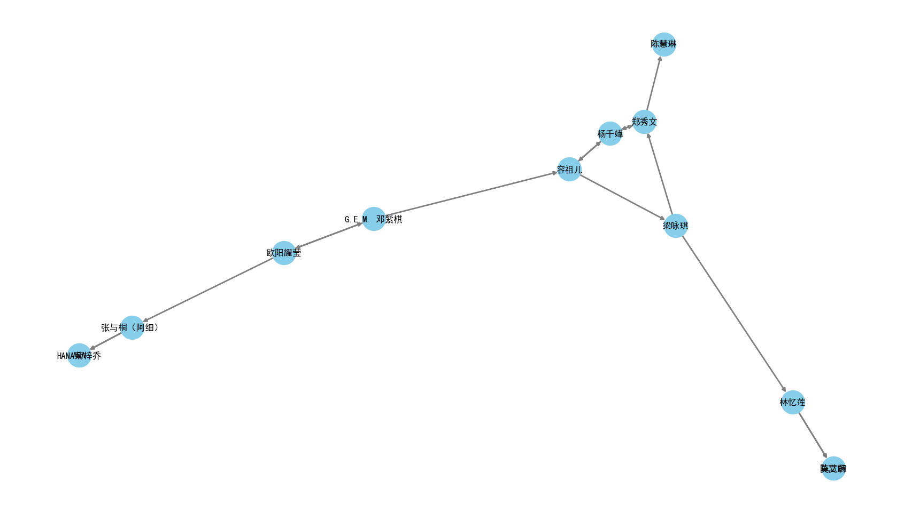
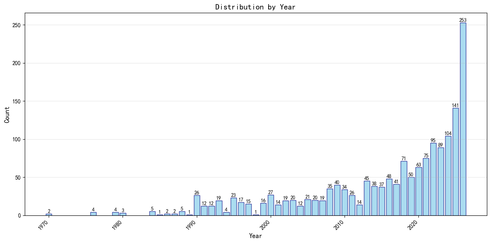
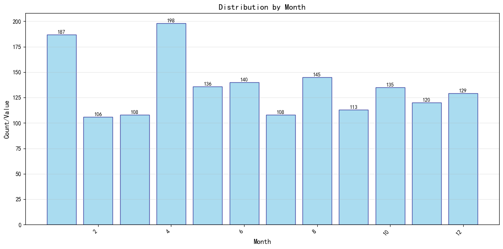

# 爬虫与信息系统 大作业 数据分析报告

——By 杨博钧 2025012810

## 词云

对歌词进行分析，分成中文歌和英文歌。

* 中文歌使用 `jieba` 进行词语划分，使用 `Counter` 库进行了词频统计，同时滤去了高频出现的虚词、语气词等无实义词，使用 `wordcloud` 制作词云
* 英文歌按空格进行词语划分，同样滤去了高频出现的虚词、语气词等无实义词，使用 `wordcloud` 制作词云

中文词云：

英文词云：

### 相似歌手关系图

从酷狗音乐的歌手主页中，爬取"相似歌手"栏目，获得与当前歌手相似的两位歌手，然后以BFS（广度优先搜索）的方式递归爬取，最终生成歌手之间的相似关系有向图。

使用了 `networkx` 库构建图，`matplotlib` 进行可视化绘制。

分别对以下三位核心歌手构建了关系图：

- **Imagine Dragons**：以 Imagine Dragons 为起点爬取相似歌手
  
- **邓紫棋（G.E.M.）**：以邓紫棋为起点爬取  
  
- **Kun**（蔡徐坤）：以 Kun 为起点爬取
  

### 歌曲时长分析

对爬取到的 1775 首歌曲的时长（单位：ms）做了统计，按分钟区间分组，制作饼状图展示各区间占比。

分析结果：

- 绝大多数歌曲时长集中在 **2-4 分钟**，符合流行音乐的普遍特征
- 小于 1 分钟和大于 5 分钟的歌曲占比较小

### 发行时间统计

通过爬取歌曲所属专辑的发行时间，对 1628 条有效数据分别按年份和月份进行统计。

**按年份分布**：

**按月份分布**：

分析结果：

- 年份分布显示爬取的歌曲主要集中在 **2018–2026 年**，以近年新歌为主
- 月份分布中，**下半年（7–12 月）** 发行的歌曲相对较多。推测 **二三月份** 发行歌曲较少的原因是春节假期， **一月份** 发行较多的原因是新年伊始。
