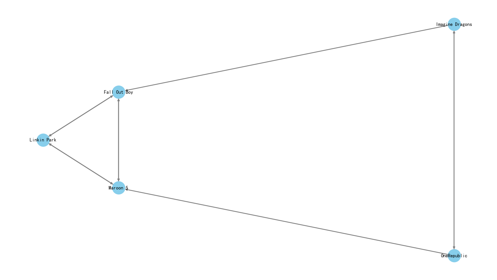
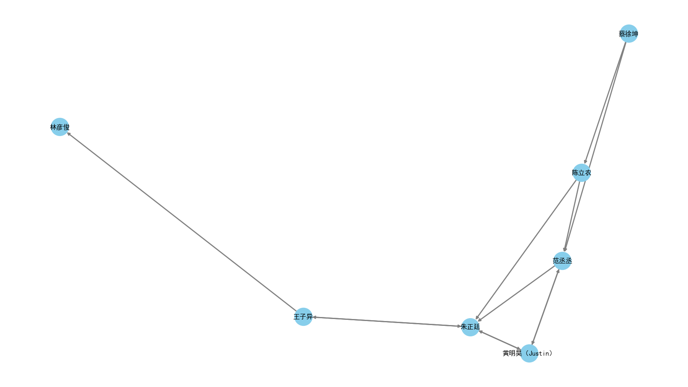
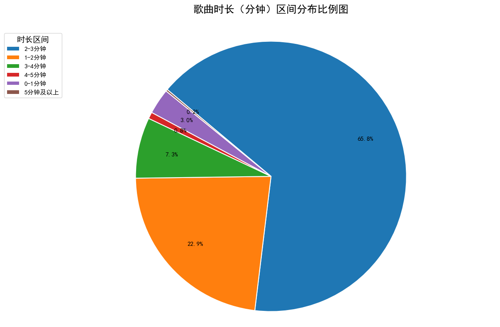

# 爬虫与信息系统 大作业 report

——By 杨博钧 2025012810

## 爬虫

**爬取网站**：酷狗音乐
**爬取歌曲的思路**：歌手列表 -> 歌手 -> 歌手主页 -> 歌曲

1. 注意到酷狗音乐有歌手栏，直接从歌手列表中爬取，按照歌手姓名的拼音顺序A-Z爬取
2. 爬取到足够歌手后，依次跳转进每个歌手的主页，爬取歌曲，每个歌手爬取约20-30首歌
3. 跳转进歌曲页面，爬取歌曲信息（时长，歌词，发行时间）

**算法**：主要使用 `requests` 进行爬取，爬取歌曲页面时使用 `playwright` 爬取歌词等

**爬取总数**：歌曲数 $2074$ 首，歌手数 $120$ 人

## Web

使用 `Django` 框架进行开发

### 主要功能

1. **歌曲列表**：以网格形式展示所有歌曲，支持分页（每页12条），随机排序
2. **歌曲详情**：展示歌曲封面、歌手、歌词等信息，支持用户发表评论，评论按时间倒序排列
3. **歌手列表**：按ID顺序展示所有歌手，支持分页
4. **歌手详情**：展示歌手头像、简介，以及该歌手的全部歌曲
5. **搜索功能**：支持按歌曲名、歌手名、歌词内容搜索，也可单独按歌手名搜索，结果分页展示，并显示搜索耗时
6. **评论管理**：支持删除评论

### 数据模型

- **Singer**（歌手）：id、name、intro、url、image
- **Song**（歌曲）：id、name、singer（外键）、url、image、lyrics
- **Comment**（评论）：id、song（外键）、content、release_time

### 技术细节

- 歌曲列表使用 `select_related` 预加载歌手信息，减少数据库查询
- 分页导航栏使用自定义算法，显示首尾页 + 当前页附近页码 + 省略号
- 搜索支持模糊匹配（`icontains`），结果去重

## 数据分析

### 词云

对歌词进行分析，分成中文歌和英文歌。

* 中文歌使用 `jieba` 进行词语划分，使用 `Counter` 库进行了词频统计，同时滤去了高频出现的虚词、语气词等无实义词，使用 `wordcloud` 制作词云
* 英文歌按空格进行词语划分，同样滤去了高频出现的虚词、语气词等无实义词，使用 `wordcloud` 制作词云

中文词云：

英文词云：

### 相似歌手关系图

从酷狗音乐的歌手主页中，爬取"相似歌手"栏目，获得与当前歌手相似的两位歌手，然后以BFS（广度优先搜索）的方式递归爬取，最终生成歌手之间的相似关系有向图。

使用了 `networkx` 库构建图，`matplotlib` 进行可视化绘制。

分别对以下三位核心歌手构建了关系图：

- **Imagine Dragons**：以 Imagine Dragons 为起点爬取相似歌手
  
- **邓紫棋（G.E.M.）**：以邓紫棋为起点爬取  
  
- **Kun**（蔡徐坤）：以 Kun 为起点爬取
  

### 歌曲时长分析

对爬取到的 1775 首歌曲的时长（单位：ms）做了统计，按分钟区间分组，制作饼状图展示各区间占比。

分析结果：

- 绝大多数歌曲时长集中在 **3-5 分钟**，符合流行音乐的普遍特征
- 小于 1 分钟和大于 5 分钟的歌曲占比较小

### 发行时间统计

通过爬取歌曲所属专辑的发行时间，对 1628 条有效数据分别按年份和月份进行统计。

**按年份分布**：

**按月份分布**：

分析结果：

- 年份分布显示爬取的歌曲主要集中在 **2018–2026 年**，以近年新歌为主
- 月份分布中，**下半年（7–12 月）** 发行的歌曲相对较多。推测 **二三月份** 发行歌曲较少的原因是春节假期， **一月份** 发行较多的原因是新年伊始。
